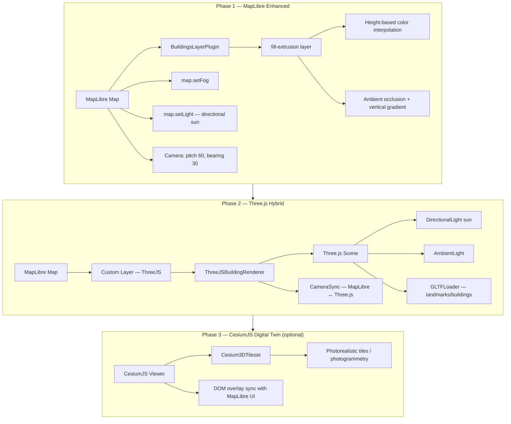
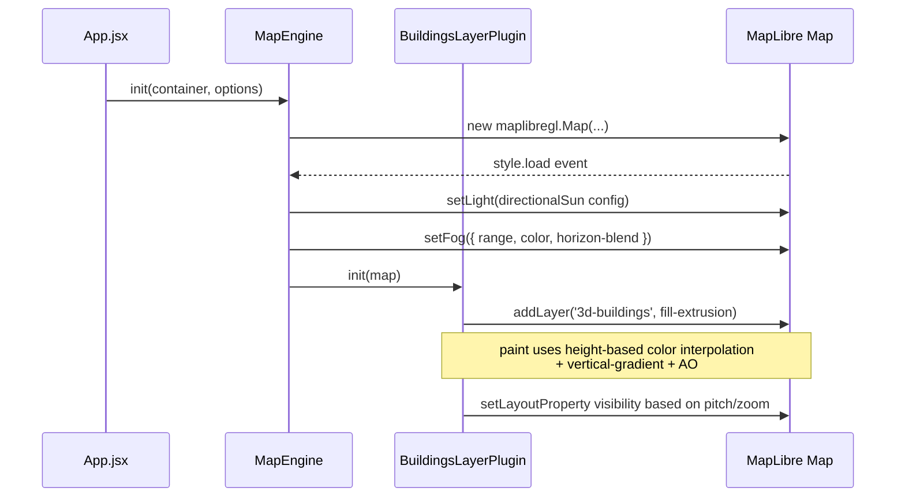
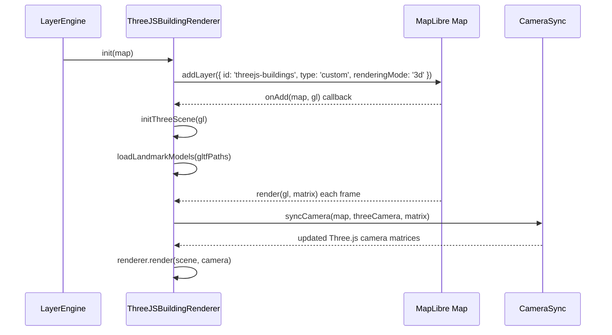

# Design Document: 3D Buildings Upgrade

## Overview

This feature upgrades the Urban Reality OS city visualization from flat/low-detail building extrusions to a fully immersive, multi-phase 3D city experience aligned with the "AI city OS" vision. The upgrade is structured in three phases: Phase 1 enhances the existing MapLibre fill-extrusion pipeline with height-based color interpolation, improved lighting, ambient occlusion, fog, and camera tuning; Phase 2 introduces a Three.js hybrid layer for GLTF/GLB landmark models synchronized with the MapLibre camera; Phase 3 (optional) adds a CesiumJS digital twin with photorealistic 3D tiles.

The project already has `three` and `three-stdlib` in its dependencies and uses MapLibre GL JS v5 with a `BuildingsLayerPlugin` that drives `fill-extrusion` via feature state. All three phases build on top of the existing `LayerEngine` / `BaseLayerPlugin` architecture without breaking the flood simulation, LOD system, or performance guards already in place.

---

## Architecture



---

## Sequence Diagrams

### Phase 1 — Enhanced Buildings Init Flow



### Phase 2 — Three.js Custom Layer Init Flow



---

## Components and Interfaces

### Component 1: BuildingsLayerPlugin (Phase 1 — Enhanced)

**Purpose**: Drives the MapLibre `fill-extrusion` layer with height-based color, improved AO, vertical gradient shading, and shadow illusion via darker base colors.

**Interface** (existing, extended):
```javascript
class BuildingsLayerPlugin extends BaseLayerPlugin {
  init(map: maplibregl.Map): void
  _syncLODState(map: maplibregl.Map): void
  _buildPaintConfig(zoom: number): FillExtrusionPaintSpec
}
```

**Responsibilities**:
- Apply height-based color interpolation (`#1e3a5f` → `#4a9eff` → `#e0f0ff`) via `fill-extrusion-color`
- Enable `fill-extrusion-vertical-gradient: true` at all zoom levels ≥ 14
- Set `fill-extrusion-ambient-occlusion-intensity: 0.85` and `fill-extrusion-ambient-occlusion-ground-radius: 18`
- Preserve existing flood simulation feature-state overrides (isCritical, submersionRatio)

### Component 2: MapEngine (Phase 1 — Fog + Lighting)

**Purpose**: Configures scene-level fog and directional sun lighting on map init and style reload.

**Interface** (existing, extended):
```javascript
class MapEngine {
  _applySceneLighting(): void   // extended with directional sun config
  _applyFog(): void             // new method
}
```

**Responsibilities**:
- Call `map.setFog({ range: [0.5, 10], color: '#ddeeff', 'horizon-blend': 0.1 })` after style load
- Call `map.setLight({ anchor: 'map', color: '#fffbe6', intensity: 0.55, position: [1.5, 225, 65] })` for sun angle
- Re-apply fog and light after every style switch (hook into `_executeStyleSwitch`)

### Component 3: ThreeJSBuildingRenderer (Phase 2 — new)

**Purpose**: A MapLibre custom layer that renders Three.js GLTF models (landmarks, key buildings) synchronized with the MapLibre camera.

**Interface**:
```javascript
interface ThreeJSBuildingRenderer {
  init(map: maplibregl.Map): void
  addModel(id: string, gltfUrl: string, lngLat: [number, number], options?: ModelOptions): Promise<void>
  removeModel(id: string): void
  setModelVisibility(id: string, visible: boolean): void
  destroy(): void
}

interface ModelOptions {
  scale?: number          // default 1.0
  rotation?: number       // Y-axis degrees, default 0
  altitude?: number       // meters above ground, default 0
  castShadow?: boolean    // default true
}
```

**Responsibilities**:
- Create a Three.js `WebGLRenderer` sharing the MapLibre WebGL context
- Maintain a `THREE.Scene` with `DirectionalLight` (sun) + `AmbientLight`
- Load GLTF/GLB models via `GLTFLoader` from `three-stdlib`
- Project model positions from lng/lat to Three.js world space using MapLibre's `MercatorCoordinate`
- Sync Three.js camera matrices from MapLibre's `CustomLayerInterface.render(gl, matrix)` callback each frame

### Component 4: CameraSync (Phase 2 — new)

**Purpose**: Translates MapLibre's projection matrix into Three.js camera matrices each render frame.

**Interface**:
```javascript
interface CameraSync {
  sync(map: maplibregl.Map, camera: THREE.Camera, matrix: number[]): void
}
```

**Responsibilities**:
- Convert MapLibre's column-major `matrix` (Float64Array) to a `THREE.Matrix4`
- Apply to `camera.projectionMatrix` and reset `camera.projectionMatrixInverse`
- Handle coordinate system differences (MapLibre Y-up vs Three.js Y-up, Z-forward)

---

## Data Models

### BuildingColorConfig

```javascript
const BUILDING_COLOR_CONFIG = {
  // Height thresholds in meters
  low:    { maxHeight: 15,  color: '#1e3a5f' },   // dark navy — low-rise
  mid:    { maxHeight: 60,  color: '#2d6a9f' },   // mid blue — mid-rise
  high:   { maxHeight: 150, color: '#4a9eff' },   // bright blue — high-rise
  tower:  { maxHeight: Infinity, color: '#e0f0ff' }, // near-white — skyscrapers
}
```

### FogConfig

```javascript
const FOG_CONFIG = {
  range: [0.5, 10],          // [start, end] in map units
  color: '#ddeeff',          // light blue-white haze
  'horizon-blend': 0.1,      // soft horizon transition
}
```

### SunLightConfig

```javascript
const SUN_LIGHT_CONFIG = {
  anchor: 'map',
  color: '#fffbe6',          // warm sunlight
  intensity: 0.55,
  position: [1.5, 225, 65],  // [radial, azimuthal, polar] — afternoon sun angle
}
```

### ModelOptions (Phase 2)

```javascript
interface ModelOptions {
  scale: number       // world-space scale multiplier
  rotation: number    // Y-axis rotation in degrees
  altitude: number    // meters above terrain
  castShadow: boolean
}
```

---

## Algorithmic Pseudocode

### Phase 1: Height-Based Color Interpolation Expression

```pascal
ALGORITHM buildHeightColorExpression()
OUTPUT: MapLibre expression array

BEGIN
  // Priority: flood simulation overrides normal color
  RETURN [
    'case',
    ['boolean', ['feature-state', 'isCritical'], false],
      criticalPulseExpression,   // existing red pulse
    
    // Normal mode: interpolate by height
    [
      'interpolate', ['linear'],
      ['coalesce',
        ['to-number', ['feature-state', 'adjustedHeight']],
        ['to-number', ['get', 'render_height']],
        ['to-number', ['get', 'height']],
        0
      ],
      0,   '#1e3a5f',   // ground level — dark navy
      15,  '#1e3a5f',   // low-rise
      30,  '#2d6a9f',   // mid-rise
      60,  '#3a82c4',   // tall
      100, '#4a9eff',   // high-rise
      200, '#e0f0ff'    // tower / skyscraper
    ]
  ]
END
```

### Phase 1: LOD Sync with Fog Awareness

```pascal
ALGORITHM _syncLODState(map)
INPUT: map — MapLibre map instance

BEGIN
  zoom  ← map.getZoom()
  pitch ← map.getPitch()
  
  shouldShow ← zoom >= MIN_ZOOM AND pitch >= 25
  
  map.setLayoutProperty('3d-buildings', 'visibility',
    IF shouldShow THEN 'visible' ELSE 'none')
  
  // Vertical gradient always on when visible
  map.setPaintProperty('3d-buildings',
    'fill-extrusion-vertical-gradient', true)
  
  // AO radius scales with zoom for detail
  aoRadius ← IF zoom >= HIGH_DETAIL_ZOOM THEN 18 ELSE 12
  map.setPaintProperty('3d-buildings',
    'fill-extrusion-ambient-occlusion-ground-radius', aoRadius)
  
  // Opacity ramp — fade in as zoom increases
  map.setPaintProperty('3d-buildings', 'fill-extrusion-opacity',
    ['interpolate', ['linear'], ['zoom'],
      13.8, 0,
      14.2, 0.78,
      16,   0.92
    ])
END
```

### Phase 2: Camera Sync Algorithm

```pascal
ALGORITHM syncCamera(map, threeCamera, matrix)
INPUT:  map         — MapLibre map instance
        threeCamera — THREE.Camera
        matrix      — Float64Array[16], column-major projection matrix from MapLibre

BEGIN
  // Convert MapLibre column-major matrix to THREE.Matrix4
  m ← new THREE.Matrix4()
  m.fromArray(matrix)
  
  // Apply to Three.js camera
  threeCamera.projectionMatrix.copy(m)
  threeCamera.projectionMatrixInverse.copy(m).invert()
  
  // Reset world matrix — MapLibre handles world transform
  threeCamera.matrixWorldNeedsUpdate ← false
END

ALGORITHM projectLngLatToWorld(lngLat, altitude, map)
INPUT:  lngLat   — [longitude, latitude]
        altitude — meters above ground
        map      — MapLibre map instance
OUTPUT: THREE.Vector3 in world space

BEGIN
  mc ← MercatorCoordinate.fromLngLat(lngLat, altitude)
  
  // MercatorCoordinate scale factor for Three.js units
  scale ← mc.meterInMercatorCoordinateUnits()
  
  RETURN new THREE.Vector3(mc.x, mc.y, mc.z)
END
```

### Phase 2: GLTF Model Loading

```pascal
ALGORITHM addModel(id, gltfUrl, lngLat, options)
INPUT:  id      — unique string identifier
        gltfUrl — URL to .glb/.gltf file
        lngLat  — [longitude, latitude]
        options — ModelOptions

BEGIN
  IF id IN this._models THEN
    RETURN  // already loaded
  END IF
  
  gltf ← AWAIT gltfLoader.loadAsync(gltfUrl)
  model ← gltf.scene
  
  // Position in Mercator world space
  worldPos ← projectLngLatToWorld(lngLat, options.altitude, this._map)
  scale    ← MercatorCoordinate.fromLngLat(lngLat).meterInMercatorCoordinateUnits()
  
  model.position.set(worldPos.x, worldPos.y, worldPos.z)
  model.scale.set(scale * options.scale, scale * options.scale, scale * options.scale)
  model.rotation.y ← options.rotation * (π / 180)
  
  IF options.castShadow THEN
    model.traverse(child →
      IF child IS Mesh THEN
        child.castShadow    ← true
        child.receiveShadow ← true
      END IF
    )
  END IF
  
  this._scene.add(model)
  this._models[id] ← model
END
```

---

## Key Functions with Formal Specifications

### `_applyFog(map)`

**Preconditions:**
- `map` is a loaded `maplibregl.Map` instance
- Style has finished loading (`style.load` event fired)

**Postconditions:**
- `map.getFog()` returns config matching `FOG_CONFIG`
- Fog is visible at distances > 0.5 map units
- No side effects on existing layers or sources

**Loop Invariants:** N/A

---

### `_applySceneLighting(map)`

**Preconditions:**
- `map` is loaded and style supports `setLight`

**Postconditions:**
- Directional light simulates afternoon sun (azimuth 225°, elevation 65°)
- Warm color `#fffbe6` applied at intensity 0.55
- Building sides facing away from sun appear darker via vertical gradient

**Loop Invariants:** N/A

---

### `ThreeJSBuildingRenderer.addModel(id, url, lngLat, options)`

**Preconditions:**
- `id` is a non-empty unique string
- `url` resolves to a valid GLTF/GLB file
- `lngLat` is a valid `[lng, lat]` pair within map bounds
- Three.js scene is initialized (`onAdd` has been called)

**Postconditions:**
- Model is added to `this._scene`
- Model is stored in `this._models[id]`
- Model position is correctly projected to Mercator world space
- Model scale accounts for Mercator distortion at given latitude

**Loop Invariants:** N/A (async, no loops)

---

### `CameraSync.sync(map, camera, matrix)`

**Preconditions:**
- `matrix` is a valid 16-element Float64Array from MapLibre's render callback
- `camera` is a `THREE.Camera` instance

**Postconditions:**
- `camera.projectionMatrix` equals the MapLibre projection matrix
- `camera.projectionMatrixInverse` is the exact inverse
- Three.js scene renders in the same perspective as the MapLibre viewport

**Loop Invariants:** N/A

---

## Example Usage

### Phase 1 — Applying Enhanced Buildings (MapEngine init)

```javascript
// In MapEngine._applySceneLighting() — extended
_applySceneLighting() {
  if (!this._map) return;
  try {
    // Directional sun — afternoon angle
    this._map.setLight({
      anchor: 'map',
      color: '#fffbe6',
      intensity: 0.55,
      position: [1.5, 225, 65],
    });
  } catch (err) {
    log.warn('setLight failed:', err);
  }
}

// New method in MapEngine
_applyFog() {
  if (!this._map) return;
  try {
    this._map.setFog({
      range: [0.5, 10],
      color: '#ddeeff',
      'horizon-blend': 0.1,
    });
  } catch (err) {
    log.warn('setFog failed:', err);
  }
}
```

### Phase 1 — Height-Based Color in BuildingsLayerPlugin

```javascript
// In BuildingsLayerPlugin.init() — updated paint config
paint: {
  'fill-extrusion-color': [
    'case',
    ['boolean', ['feature-state', 'isCritical'], false],
    ['interpolate', ['linear'], ['feature-state', 'pulsePhase'],
      0, '#fecaca', 0.5, '#dc2626', 1, '#fecaca'],
    [
      'interpolate', ['linear'],
      ['coalesce',
        ['to-number', ['feature-state', 'adjustedHeight']],
        ['to-number', ['get', 'render_height']],
        ['to-number', ['get', 'height']],
        0,
      ],
      0,   '#1e3a5f',
      15,  '#1e3a5f',
      30,  '#2d6a9f',
      60,  '#3a82c4',
      100, '#4a9eff',
      200, '#e0f0ff',
    ],
  ],
  'fill-extrusion-vertical-gradient': true,
  'fill-extrusion-ambient-occlusion-intensity': 0.85,
  'fill-extrusion-ambient-occlusion-ground-radius': 18,
  // ... height/base/opacity unchanged
}
```

### Phase 2 — ThreeJSBuildingRenderer as MapLibre Custom Layer

```javascript
// src/engines/ThreeJSBuildingRenderer.js
import * as THREE from 'three';
import { GLTFLoader } from 'three-stdlib';
import maplibregl from 'maplibre-gl';

export class ThreeJSBuildingRenderer {
  constructor() {
    this._scene = new THREE.Scene();
    this._camera = new THREE.Camera();
    this._renderer = null;
    this._models = {};
    this._loader = new GLTFLoader();
    this._map = null;
  }

  get customLayer() {
    return {
      id: 'threejs-buildings',
      type: 'custom',
      renderingMode: '3d',
      onAdd: (map, gl) => {
        this._map = map;
        this._renderer = new THREE.WebGLRenderer({
          canvas: map.getCanvas(),
          context: gl,
          antialias: true,
        });
        this._renderer.autoClear = false;

        const sun = new THREE.DirectionalLight(0xfffbe6, 1.2);
        sun.position.set(0.5, 1, 0.8);
        this._scene.add(sun);
        this._scene.add(new THREE.AmbientLight(0xffffff, 0.4));
      },
      render: (gl, matrix) => {
        // Sync camera
        const m = new THREE.Matrix4().fromArray(matrix);
        this._camera.projectionMatrix.copy(m);
        this._camera.projectionMatrixInverse.copy(m).invert();

        this._renderer.resetState();
        this._renderer.render(this._scene, this._camera);
        this._map.triggerRepaint();
      },
    };
  }

  async addModel(id, gltfUrl, lngLat, options = {}) {
    const { scale = 1, rotation = 0, altitude = 0 } = options;
    const mc = maplibregl.MercatorCoordinate.fromLngLat(lngLat, altitude);
    const s = mc.meterInMercatorCoordinateUnits() * scale;

    const gltf = await this._loader.loadAsync(gltfUrl);
    const model = gltf.scene;
    model.position.set(mc.x, mc.y, mc.z);
    model.scale.set(s, s, s);
    model.rotation.y = rotation * (Math.PI / 180);
    this._scene.add(model);
    this._models[id] = model;
  }
}
```

---

## Correctness Properties

*A property is a characteristic or behavior that should hold true across all valid executions of a system — essentially, a formal statement about what the system should do. Properties serve as the bridge between human-readable specifications and machine-verifiable correctness guarantees.*

### Property 1: Height-color expression resolves for all building heights

For any building height `h` in `[0, 500]` meters, the `fill-extrusion-color` MapLibre expression must resolve to a valid, non-null hex color string.

**Validates: Requirements 2.1**

### Property 2: isCritical overrides height-based color

For any building with `isCritical` feature state set to `true`, the resolved `fill-extrusion-color` must equal the critical pulse interpolation output, not the height-based interpolation output.

**Validates: Requirements 2.2, 4.1**

### Property 3: submersionRatio color preserved when not critical

For any building with `isCritical = false` and any `submersionRatio` in `[0, 1]`, the resolved `fill-extrusion-color` must equal the submersion gradient interpolation (slate → orange), not the height-based color.

**Validates: Requirements 2.3, 4.2**

### Property 4: Fog is non-null after any style switch

For any style name in the set of supported styles, after `switchStyle()` completes and the new style has loaded, `map.getFog()` must return a non-null value matching FOG_CONFIG.

**Validates: Requirements 1.1, 1.3**

### Property 5: addModel is idempotent per id

For any model `id`, calling `addModel(id, ...)` twice must result in exactly one model with that `id` in `scene.children` — the second call must be a no-op.

**Validates: Requirements 7.2**

### Property 6: projectLngLatToWorld returns finite coordinates

For any valid `[lng, lat]` pair within geographic bounds (`lng ∈ [-180, 180]`, `lat ∈ [-85, 85]`), `MercatorCoordinate.fromLngLat` must return a `THREE.Vector3` with all components finite (no `NaN` or `Infinity`).

**Validates: Requirements 7.3**

### Property 7: CameraSync projection matrix inverse identity

For any valid 16-element projection matrix array from MapLibre's render callback, the resulting `camera.projectionMatrix` multiplied by `camera.projectionMatrixInverse` must equal the identity matrix within floating-point tolerance (epsilon ≤ 1e-10).

**Validates: Requirements 6.4**

### Property 8: LOD visibility rule holds for all zoom/pitch combinations

For any zoom level and pitch value, `_syncLODState` must set the `3d-buildings` layer visibility to `'visible'` if and only if `zoom >= 14 AND pitch >= 25`; otherwise it must be `'none'`.

**Validates: Requirements 3.1, 3.2**

### Property 9: GLTF URL allowlist rejects untrusted origins

For any `gltfUrl` whose origin is not in the configured allowlist, `addModel` must reject the request without loading the file or modifying the scene.

**Validates: Requirements 9.2**

---

## Error Handling

### Scenario 1: `setFog` not supported on style

**Condition**: Some MapLibre styles or older runtimes may not support `setFog`
**Response**: Wrap in try/catch, log warning, continue without fog
**Recovery**: Fog is a visual enhancement only; map remains fully functional

### Scenario 2: GLTF model fails to load (Phase 2)

**Condition**: Network error or invalid GLB file at `gltfUrl`
**Response**: Log error, skip adding model to scene, do not throw
**Recovery**: Map and MapLibre buildings continue rendering; Three.js scene renders without the failed model

### Scenario 3: WebGL context loss (Phase 2)

**Condition**: Browser reclaims WebGL context (memory pressure, tab switch)
**Response**: Listen for `webglcontextlost` on canvas; pause Three.js render loop
**Recovery**: On `webglcontextrestored`, reinitialize `THREE.WebGLRenderer` and reload models

### Scenario 4: Style switch during Three.js render (Phase 2)

**Condition**: User switches map style while Three.js custom layer is active
**Response**: MapLibre removes and re-adds custom layers on style switch; `onAdd` is called again
**Recovery**: `ThreeJSBuildingRenderer` must reinitialize renderer in `onAdd` and reload models

### Scenario 5: `3d-buildings` layer missing during LOD sync

**Condition**: Style is reloading; `map.getLayer('3d-buildings')` returns undefined
**Response**: Wrap `setLayoutProperty` / `setPaintProperty` calls in try/catch (already done)
**Recovery**: Next `_syncLODState` call after style reload will succeed

---

## Testing Strategy

### Unit Testing Approach

- Test `buildHeightColorExpression()` returns a valid MapLibre expression array with correct stop values
- Test `_applyFog()` calls `map.setFog` with the correct config object
- Test `projectLngLatToWorld()` returns a `THREE.Vector3` with correct Mercator coordinates for known lng/lat pairs
- Test `CameraSync.sync()` produces a `projectionMatrix` that is the exact inverse of `projectionMatrixInverse`
- Test `addModel()` idempotency — calling twice with same `id` results in exactly one model in `scene.children`

### Property-Based Testing Approach

**Property Test Library**: fast-check

- For any building height `h ∈ [0, 500]`, the color expression must resolve to a valid hex color string
- For any `[lng, lat]` within valid bounds, `projectLngLatToWorld` must return a finite `THREE.Vector3` (no NaN/Infinity)
- For any valid 16-element matrix array, `CameraSync.sync` must produce a `projectionMatrixInverse` that satisfies `M * M⁻¹ ≈ Identity` within floating-point tolerance

### Integration Testing Approach

- Verify that after `MapEngine.init()`, `map.getFog()` returns a non-null fog config
- Verify that after `BuildingsLayerPlugin.init()`, the `3d-buildings` layer exists with `fill-extrusion-vertical-gradient: true`
- Verify that switching map style and waiting for `style.load` results in fog and lighting being re-applied
- Verify that the flood simulation feature-state (`isCritical`, `submersionRatio`) still overrides building color correctly after Phase 1 paint changes

---

## Performance Considerations

- Phase 1 changes are purely declarative MapLibre paint expressions — zero additional CPU/GPU cost beyond the existing fill-extrusion pipeline
- Fog is a GPU post-process in MapLibre; negligible cost on modern hardware
- Phase 2 Three.js renderer shares the MapLibre WebGL context — no second GPU context overhead; however, `renderer.resetState()` must be called each frame to avoid state corruption
- GLTF models should be loaded lazily (only when zoom ≥ 15) and cached after first load to avoid repeated network requests
- Three.js scene should be limited to landmark-scale models (< 50 objects); per-building GLTF is not viable at city scale — the MapLibre fill-extrusion layer handles the bulk of buildings
- Phase 3 (CesiumJS) runs in a separate DOM container and WebGL context; it is a full replacement of the MapLibre view for the digital twin mode, not an overlay

---

## Security Considerations

- GLTF/GLB files loaded from external URLs must be validated against a trusted allowlist to prevent loading arbitrary 3D content
- MapTiler API key is already managed via `VITE_MAPTILER_API_KEY` env var; no new keys are introduced in Phase 1
- Phase 3 CesiumJS may require a Cesium Ion access token — must be stored in `.env` and never committed

---

## Dependencies

| Dependency | Phase | Status | Notes |
|---|---|---|---|
| `maplibre-gl` v5 | 1 | Already installed | `setFog`, `setLight`, `fill-extrusion-vertical-gradient` all supported |
| `three` v0.183 | 2 | Already installed | `THREE.WebGLRenderer`, `THREE.Scene`, `THREE.Camera` |
| `three-stdlib` v2.36 | 2 | Already installed | `GLTFLoader` |
| `cesium` | 3 | Not installed | `npm install cesium` when Phase 3 begins |
| GLTF/GLB model assets | 2 | To be sourced | Landmarks, infrastructure models; place in `public/models/` |
